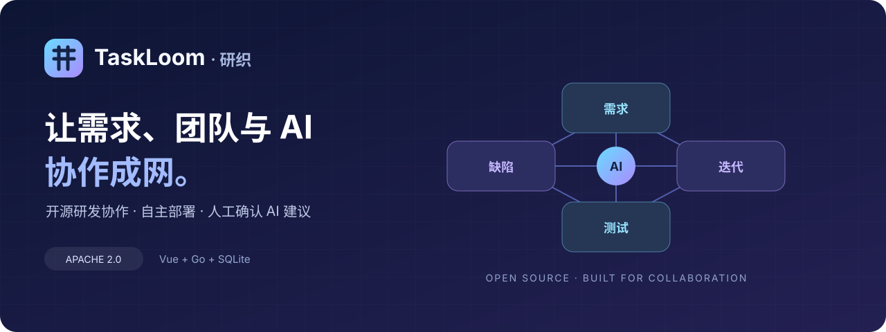
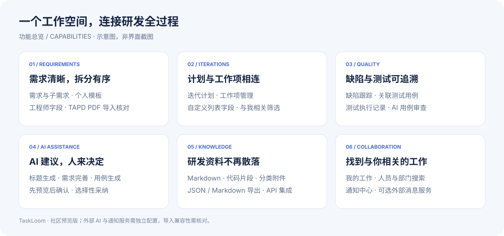
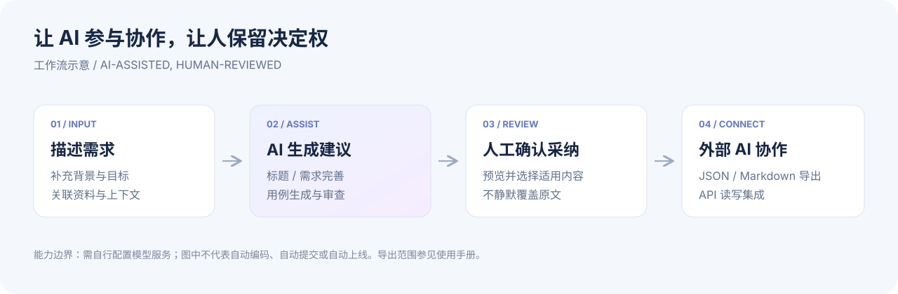

# TaskLoom

**An open-source, self-hosted R&D collaboration and project management tool for teams evaluating TAPD and Teambition alternatives.**

[中文文档](README.md) · [API documentation](docs/internal-api-reference.md) · [Contributing](CONTRIBUTING.md)

Connect requirements, agile iterations, bug tracking, test cases, discussions and delivery in one workspace.

## Highlights

- Requirement and sub-requirement management, personal templates and engineering role fields.
- Iterations, defects, test cases and execution records.
- AI-assisted PRD refinement and defect-description improvement, plus title/test generation and test review. Review the outgoing text and proposed additions, choose sections to adopt, then save the work item yourself.
- Markdown/code editing, categorized attachments, JSON/Markdown requirement exports and API integrations for AI coding workflows.
- Personal work, search and full notification text. Project-scoped personal API credentials can paginate authorized work items, details and comments; reading the owner's project notifications needs its own scope and never changes read status.
- Vue desktop application and a React mobile workbench with four tabs: My work, Requirements, Iterations and Notifications. Mobile focuses on reading, filters and notifications; complex editing can use the desktop view.
- Revocable requirement text-snapshot links expire after seven days and stop working if their creator loses access. Anyone holding a valid link can read the snapshot; review its text before sharing. Internal people, comments and authenticated attachment links are excluded.
- Release-note previews and exports, configurable WeCom self-built applications and workload trends. Trends support planning and data review; they are not an individual performance score.
- TAPD PDF import with mapping review; compatibility depends on the input document.

## Product overview

These are capability diagrams, not application screenshots. External AI, WeChat sign-in and notification services require separate configuration. The demo launcher forces WeCom mock mode. AI output needs human review; no automatic code commits or deployment are implied.

## Get started

Use Node >=22.12, pnpm 11.19.0 and Go 1.27.1. Clone this repository, run `pnpm install --frozen-lockfile`, `pnpm build`, `go build -o server ./cmd/server`, `cp -R dist web`, then `node start.mjs`.

Open http://127.0.0.1:8080. Initial login: **Admin / 123456**. Password rotation is mandatory; business access is restricted and the server refuses a non-loopback listener until rotation. Do not expose initial setup through a public reverse proxy; use an SSH tunnel on remote hosts. The synthetic organization has eight departments and eleven fictional members with independent random passwords. Data and session secrets are stored in the local data/ directory. Do not import a historical commercial database into this community release.

## Status

0.2.0-rc1 is a prerelease, not a production-readiness guarantee or a promise of feature parity with TAPD/Teambition. There is no affiliation with either product. Automatic code commits, AI subtask decomposition and change-impact analysis are roadmap items, not delivered features. External AI requires your own configuration and may incur provider fees.

Run `go test ./...`, `pnpm typecheck`, `pnpm build` and `pnpm test`. The frontend runner discovers every `test-*.mjs` and `*.test.mjs` suite under scripts/. Automated and mock-service checks do not replace deployment, permission, mobile-browser, real-provider, dependency-audit or backup-recovery acceptance in your own environment.

Vue 3 / React / TypeScript + Go + SQLite. Web only; no community DMG or historical Flutter client is shipped. Environment variables and some storage/MCP identifiers retain DEVFLOW/devflow compatibility names; current Web requests use X-TaskLoom-* headers. Licensed under Apache-2.0; third-party components retain their licenses. See [third-party notices](THIRD_PARTY_NOTICES.md).
